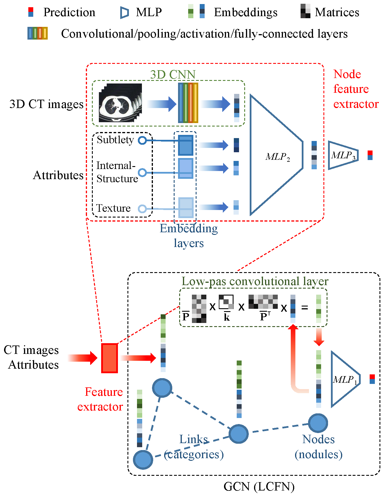

## Dual Convolutional Neural Network for Lung Nodule Classification

### Introduction
This is an official pytorch implementation for the paper "Dual Convolutional Neural Network for Lung Nodule Classification".

### Requirements
- opencv-python 
- numpy
- pytorch
- sklearn
- tqdm 
- [pylidc](https://pylidc.github.io/)

### Enviroment
The code is developed using python 3.7 on Ubuntu 16.04. NVIDIA GPUs are needed. The code is developed and tested using 2 NVIDIA 1080ti GPU cards. 

### Quick start
1. Install the requirements.
2. Download the [LIDC-IDRI](https://wiki.cancerimagingarchive.net/display/Public/LIDC-IDRI) dataset, and set the configuration of  pylidc. You can get more information about setting configuration of pylidc from [link](https://pylidc.github.io/install.html).
3. Data preparation: `prepare_data.ipynb`
4. Baseline: `run_baseline.ipynb`
5. Our model(Dual-CNN):`run_Dual-CNN.ipynb`
